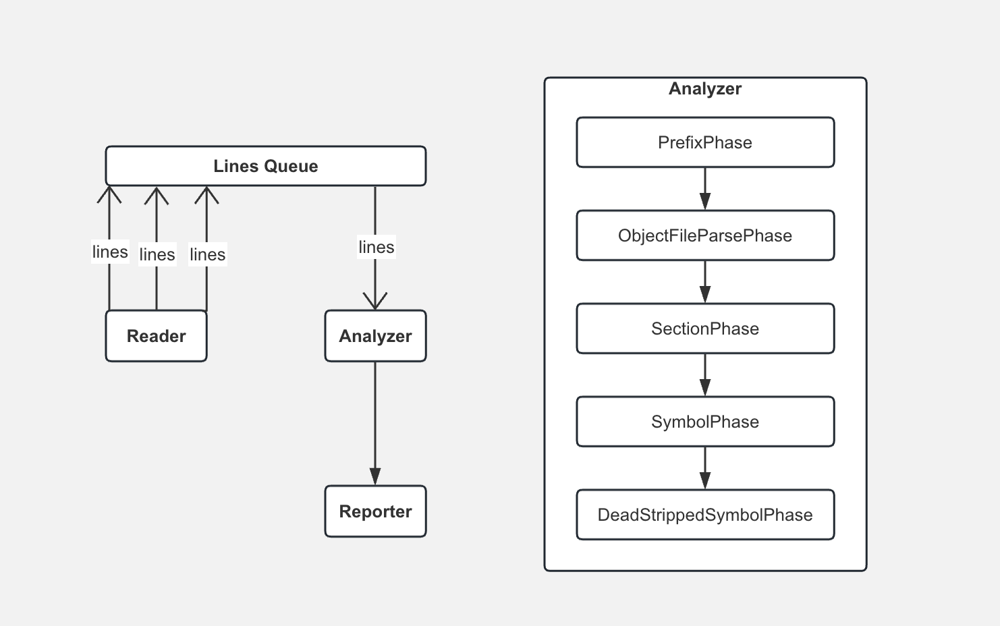

##

  
  

   
  

  <h1 align="center"><b>plinkmap</b></h1>
  

  analyze your linkmap file
     
    <a href="https://github.com/0renlyhuang/plinkmap/releases"><strong>Install »</strong></a>
     
  

# What is plinkmap?

`plinkmap` is a CLI tool, converting linkmap file to a detail report in HTML, which can be used to analyze package size.

# How to use plinkmap?
USAGE:   
    
    plinkmap --linkmap-paths <linkmap-paths> ... --output-dir <output-dir> --filters <filters> ...

OPTIONS:  
    
    -l, --linkmap-path \<linkmap-paths>:  The linkmap files to parse.
    -o, --output-dir \<output-dir>:  The output directory.  
    -f, --filters \<filters>:  The tags to filter path of object files.  
    -h, --help: Show help information.

EXAMPLE:  

    
    plinkmap --linkmap-paths a.linkmap b.linkmap --output-dir output/dir/ --filters game music

# How plinkmap implemented?
`plinkmap` is implemented in SwiftCLI and it's designed to parse large linkmap files.  
At the time plinkmap implemented, there is no other tools able to parse linkmap file over 500MB, and that is plinkmap comes for.

plinkmap works in a producer-consumer pattern. Reader consistently reads linkmap file and sends the content to the Analyzer. Analyzer consumes the content in a sequential work flow pattern, with PrefixPhase, ObjectFileParsePhase, SectionPhase, SymbolPhase and DeadStrippedSymbolPhase in order. Each phase runs in concurrency(multi-threads). After the Analyzer finishes, Reporter will generate a detail report in HTML format.

# Support
If you have any problems you can open an issue on this repository.

# License
`plinkmap` is distributed under [MIT License](/LICENSE).
